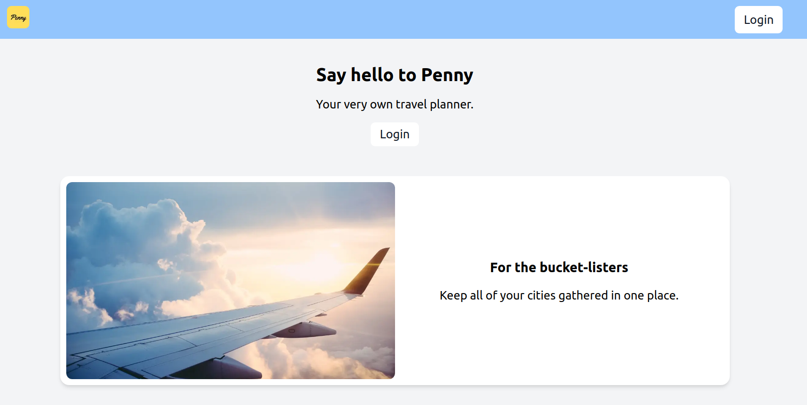
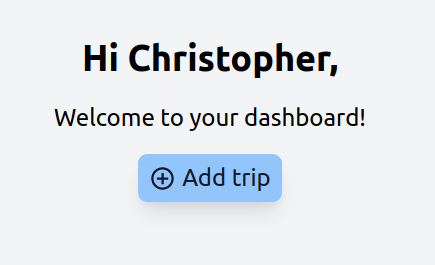
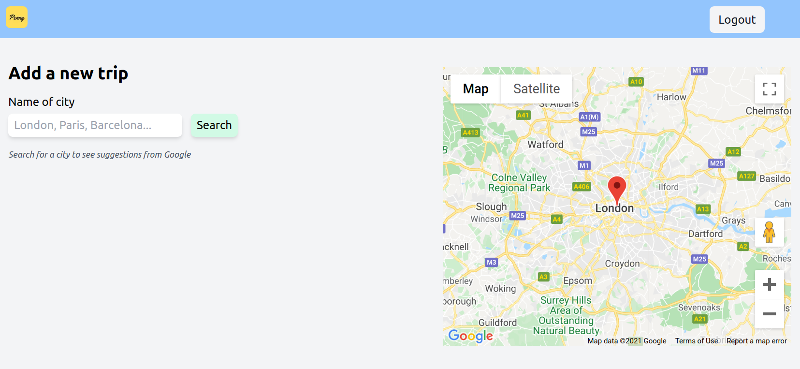
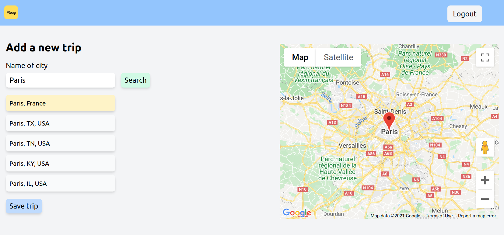
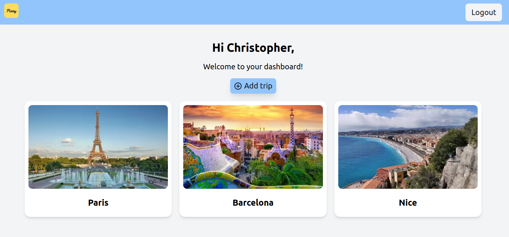
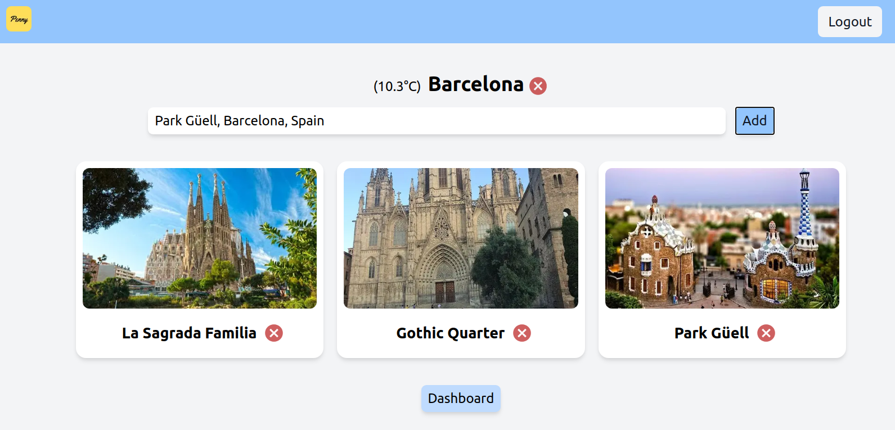

# What is [Penny](penny.christopherklint.com)?

[Penny](penny.christopherklint.com) is a travel planner that is integrated with Facebook API through Oauth login functionality, Google Maps API for places and cities, and Open Weather API for receiving the current weather.

I chose these features because I wanted to keep the web app fast and simple while allowing for the user to do as much travel planning as they wanted to do. Having a lean web application with the possibility for more features later on was the way to go!

## Standard user flow of Penny

Here is a step by step overview of the user flow for the app:

1. Arrive at the homepage and sign in with Facebook via auth0
2. Login successful, reach the travel pplanner dashboard
3. Create trips based on different cities
4. Add places to the trips
5. If the user changes their mind, they can delete the places and/or trips
6. Eat. Sleep. Repeat!

## Screenshots

|                                |                                    |
| ------------------------------ | ---------------------------------- |
|         |      |
|    |     |
|  |  |
|  |             |

## [General docs](docs/docs.md)

## [Developer docs](docs/dev/dev-docs.md)
