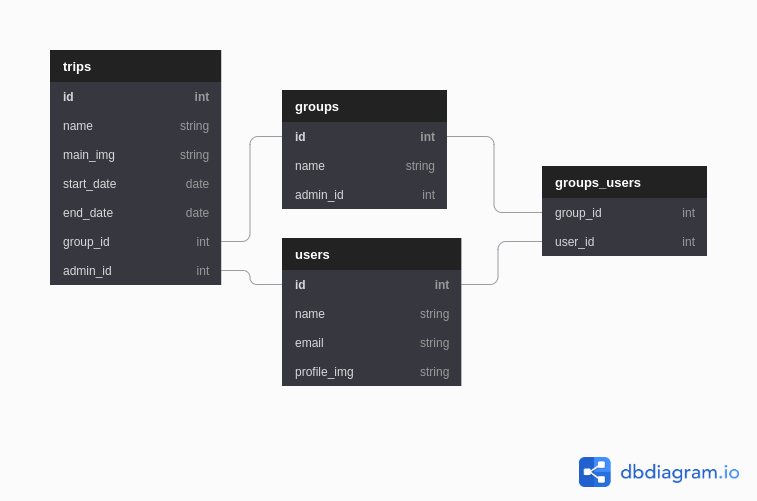

# Project proposal

1. What tech stack will you use for your final project? We recommend that you use
   React and Node for this project, however if you are extremely interested in
   becoming a Python developer you are welcome to use Python/Flask for this
   project.

   Tech stack will be the following:

   - Nextjs
   - React
   - Redux
   - Node
   - Express
   - Typescript
   - React Native (maybe)

2. Is the front-end UI or the back-end going to be the focus of your project? Or are
   you going to make an evenly focused full-stack application?

   The focus will be on the backend of the application with a quite simplistic frontend. Dream goal is full-stack of course, but feels like the backend is going to need the most focus.

3. Will this be a website? A mobile app? Something else?

   The starting plan is to use a website and if I have enough time then a mobile app as well.

4. What goal will your project be designed to achieve?

   The goal of my project is to create a travel budget and planner app with a custom API.

5. What kind of users will visit your app? In other words, what is the demographic of
   your users?

   The demographic of my users are university students between the ages of 18-26. This is because they do a lot of travelling in groups during their studies and are tight on spending money so budgeting is extra important.

6. What data do you plan on using? How are you planning on collecting your data?
   You may have not picked your actual API yet, which is fine, just outline what kind
   of data you would like it to contain. You are welcome to create your own API and
   populate it with data. If you are using a Python/Flask stack are required to create
   your own API.

   I am planning on creating my on API and populating it with data. The data that I will be using are user information, trip information (flights, hotels, destinations, pictures, notes, etc.), and other content derived from user input.

7. In brief, outline your approach to creating your project (knowing that you may not
   know everything in advance and that these details might change later). Answer
   questions like the ones below, but feel free to add more information:

- What does your database schema look like?

  

- What kinds of issues might you run into with your API? This is especially
  important if you are creating your own API, web scraping produces
  notoriously messy data.

  Issues include a slow app due to a poorly structure API, a server issues, and data errors from poorly structured models.

- Is there any sensitive information you need to secure?

  I will be securing client API secrets.

- What functionality will your app include?

  Budgeting for trips, putting in your flight and hotel information, being able to keep track of money for the trip, etc.

- What will the user flow look like?

  1. Login with Google or Facebook
  2. Enter trips dashboard where you can create trips or groups
  3. Add trip or group
  4. Go through process of filling in the form for the new trip or group
  5. Once completed, start planning a budget.
  6. Add a trip itenerary.
  7. Use the Split the Bill functionality to see who pays what.

- What features make your site more than a CRUD app? What are your
  stretch goals?

  1. Calculations for the user how much needs to be saved before the trip
  2. Adding in flight and hotel information and updating the price
  3. Splitting of costs with other users
  4. Adding users to the trip and having them edit as well
